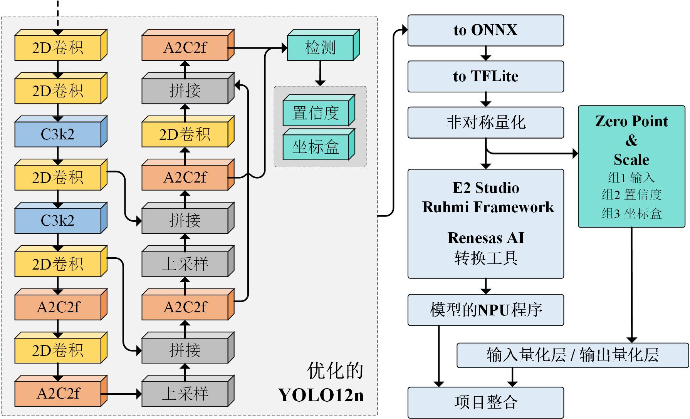

# YOLOv12n 水果检测 · 训练与量化部署库

针对蓝莓 / 草莓采摘场景的轻量化目标检测模型训练、验证与量化部署工具库。本仓库是瑞萨 RA8P1 嵌入式采摘系统（主控 Cortex-M85 + Arm Ethos-U NPU）配套的**模型侧代码**：在 PC 端完成 YOLOv12n 的训练、ONNX 导出与 TFLite int8 量化，产出的轻量模型最终部署到 Ethos-U NPU 上做实时推理。


## 主要功能


- **优化的 YOLOv12n 模型**：`cfgs/yolov12.yaml` 定义了一个面向嵌入式部署裁剪的轻量结构 —— 输入 `160×160`、单类（`nc=1`）、骨干 + `A2C2f` + **两尺度检测头**（P3/P4，去掉 P5 大目标头），在保持检测精度的同时显著降低算力与内存开销。
- **自定义训练循环**：`trainer.py` 基于 Ultralytics 底层 `DetectionModel` / 数据集构建器 / ops 实现，支持：
  - EMA（指数滑动平均）权重
  - 预训练权重加载与分层冻结微调
  - 线性 / 余弦学习率调度、Adam/AdamW 优化器
  - 梯度裁剪、`close_mosaic`（最后 N 个 epoch 关闭 mosaic 在完整原图上精调）
  - mAP50 / mAP50-95 / Precision / Recall / F1 等指标评估与 TensorBoard 可视化
- **轻量检测指标**：`metrics.py` 提供 Precision/Recall/F1、AP、mAP@0.5、mAP@0.5:0.95 及推理速度（延迟/FPS）统计；`utils.py` 提供 sigmoid / 坐标转换 / IOU / NMS 等后处理。
- **量化部署流水线**：`export.ipynb` 完成 `PyTorch → ONNX(opset 12) → onnxsim/onnxslim 简化 → onnx2tf → TFLite`，支持 `full_integer_quant`(int8)、`int16 act`、`dynamic_range`、`float16`、`float32` 多种量化方式，并对 int8 模型的 sigmoid 查找表与量化精度进行分析。
- **推理与测试**：`test.ipynb` 支持 PyTorch 模型推理、ONNX Runtime 测试、C 头文件导出（`input_chw.h` / `input.h`）以及 RTT 输出结果可视化，打通从训练到嵌入式落地的链路。

## 目录结构

```
├── main.py                 # 训练入口
├── trainer.py              # 自定义训练循环（EMA/冻结/调度/评估）
├── metrics.py              # 轻量检测指标（mAP、F1 等）
├── utils.py                # NMS/IOU 等后处理工具
├── ema.py                  # 指数滑动平均
├── datasets.py             # 旧版数据集加载（含 albumentations 增强）
├── export.ipynb            # ONNX → TFLite int8 量化导出
├── test.ipynb              # 推理验证 / C 头文件导出
├── cfgs/
│   ├── yolov12.yaml        # 优化后的轻量 YOLOv12n 结构（160×160, nc=1）
│   ├── yolov12_default.yaml# 原始三尺度 P3-P5 结构
│   └── train_cfg.yaml      # 训练 / 数据 / 增强超参
├── data/
│   ├── blueberry_cls_v1~v4 # 蓝莓检测数据集（v4 为当前训练集）
│   └── strawberry_cls      # 草莓成熟度数据集（fullripe/semiripe/unripe 3 类）
├── ckpts/                  # 训练输出的模型权重
├── logs/                   # TensorBoard 日志与各版本权重（v1/v4/v4.1）
└── pts/yolov12n.pt         # 预训练权重
```

## 环境安装

1. 前往 <https://pytorch.org/get-started/locally/> 安装 `torch` / `torchvision`。
2. 执行 `pip install -r requirements.txt` 安装其余依赖。

量化导出还需额外安装：`onnx`、`onnxsim`、`onnxslim`、`onnx2tf`、`tensorflow`、`onnxruntime`、`fvcore`。

## 数据准备

数据集目录按 YOLO 格式组织，每个子集包含 `images/` 与 `labels/`：

```
data/blueberry_cls_v4/
├── train/
│   ├── images/
│   └── labels/
└── val/
    ├── images/
    └── labels/
```

- 蓝莓数据集：单类（`ripe`），使用 `data/blueberry_cls_v4`。
- 草莓数据集：3 类（`fullripe` / `semiripe` / `unripe`），使用 `data/strawberry_cls`，类别定义见 `data/strawberry_cls/fruit.yaml`。

在 `cfgs/train_cfg.yaml` 中修改 `dataset.root_dir` 指向目标数据集，并相应调整 `dataset.names`、`cfgs/yolov12.yaml` 中的 `nc`。

## 开始训练

```bash
python main.py
```

- 训练超参（学习率、epochs、EMA、增强等）在 `cfgs/train_cfg.yaml` 中配置。
- 权重保存至 `ckpts/`，TensorBoard 日志写入 `logs/`。

查看训练曲线：

```bash
tensorboard --logdir logs
```

## 模型导出与量化

在 `export.ipynb` 中依次执行：

1. 加载训练好的权重，导出 ONNX（`opset=12`，输入名 `input1`，输出 `output0/output1`）。
2. 用 `onnxsim` / `onnxslim` 简化模型图。
3. 用 `onnx2tf` 转 TFLite 并做 int8 量化（含自定义校准集 `tmp_tflite_int8_calibration_images.npy`），输出到 `save_model/`，生成 int8 / int16 / fp16 / fp32 多种量化版本。
4. 校验输入输出张量形状与量化参数（scale / zero_point）。

导出产物示例：`onnx/v4.1/yolov12_160_sm.onnx` 与 `onnx/v4.1/save_model/yolov12_160_sm_full_integer_quant.tflite`。

## 推理测试

`test.ipynb` 提供端到端验证：PyTorch 模型可视化预测、ONNX Runtime 推理、RTT 串口输出解析与画框、以及将测试图导出为 C 数组头文件（`input_chw.h`）供嵌入式端使用。

## 已训练模型

| 版本 | 权重 | 说明 |
|------|------|------|
| v1   | `logs/v1/model_epoch_339_0.6336.pth` | 早期蓝莓模型 |
| v4   | `logs/v4/model_epoch_299_0.6469.pth` | 蓝莓 v4 |
| v4.1 | `logs/v4.1/model_epoch_359_0.6361.pth` | 蓝莓 v4.1（当前部署版本） |
| —    | `ckpts/model_epoch_*_*.pth` | 训练过程保存的检查点 |

## 开源许可

本项目采用 **GNU Affero General Public License v3.0 (AGPL-3.0)** 开源，详见 [LICENSE](./LICENSE)。基于的 Ultralytics 组件遵循其各自许可协议。
